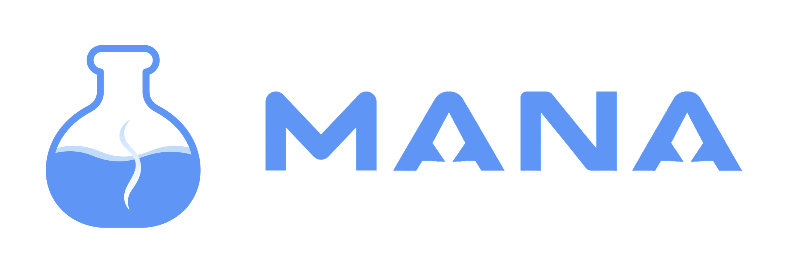
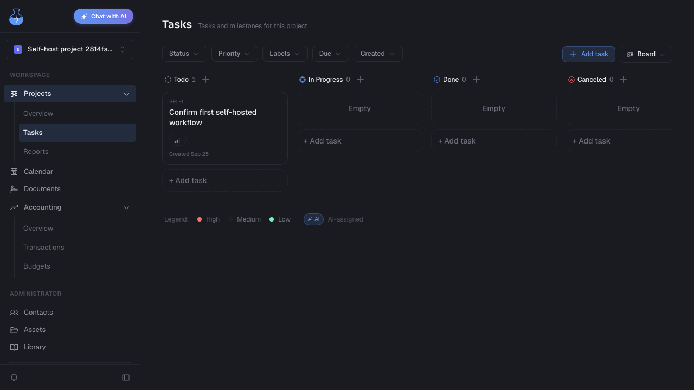

**A self-hosted workspace for freelancers.** Keep clients, projects, tasks, invoices, and money in one place. Available in English and Thai.

## Try it locally

**Local preview** — core features work without paid accounts or API keys. AI and external integrations are optional. This setup is for your computer, not a public server.

Install Git and start [Docker Desktop](https://docs.docker.com/desktop/) with Compose 2.24 or newer. Linux users can use Docker Engine with the Compose plugin.

```sh
git clone https://github.com/Duckinm/mana-community.git
cd mana-community
sh scripts/self-host.sh
```

The first run downloads and builds the app. Wait for **“MANA is ready”**. No Bun installation or manual environment setup is needed.

1. Open [MANA](http://localhost:3300/register) and create an account.
2. Verify it through the [local email inbox](http://localhost:38025). Emails stay here; they are not sent to real recipients.
3. **Try your first workflow:** add a contact → create a project → add a task. Then make an invoice and record a payment manually.

[Setup help, backups and updates →](docs/self-hosting.md)



## What you can do

- Manage contacts, projects, tasks, and calendar events.
- Create quotations and invoices, download PDFs, and track income and expenses.
- Keep files alongside your work. Add [AI and integrations](docs/self-hosting.md#optional-integrations) when you need them.

Self-hosted core features have no Cloud subscription limits. Prefer managed hosting? Try [MANA Cloud](https://app.heymana.app).

## Help shape MANA

Tried it? [Tell us what worked or got in your way](https://github.com/Duckinm/mana-community/issues/new/choose). Bug reports, translations, and small fixes are welcome.

[Contribute](CONTRIBUTING.md) · [Development](docs/development.md) · [Roadmap](ROADMAP.md) · [Releases](https://github.com/Duckinm/mana-community/releases) · [Security](SECURITY.md)

Copyright © 2026 MANA. [AGPL-3.0-only](LICENSE) · [Third-party notices](THIRD_PARTY_NOTICES.md) · [Name and logo](docs/licensing.md)
